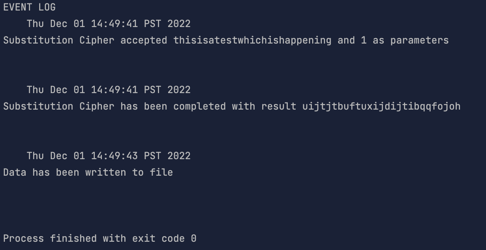
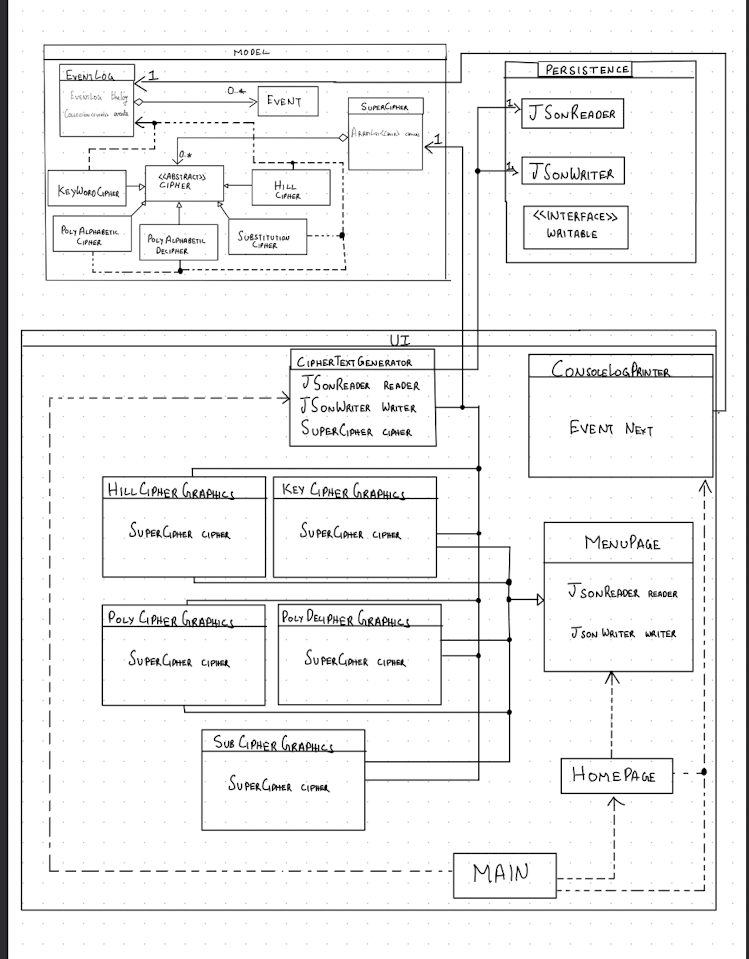

# My Personal Project
This project will be a Cipher text generator.
#### Motivation behind the project
I've always been interested in cryptography and encryption, and I thought I'd take a shot at it as my first project.

## Who would use this project?
Any individual who wants to implement basic cipher techniques for their messages
## Features of this project
- Multiple Cipher techniques.
- All ciphered text can be decrypted provided that the cipher method is known.

 
### User stories
- As a user, I want to be able to run my message through a cipher of my choice. 
- As a user, I want to be able to clearly see the encryption steps in Poly Alphabetic, Substituion and Keyword Ciphers.
- As a user, I want to be able to run an encrypted message through a decrypt function for Poly Alphabetic Cipher and Substituion Ciphers.
- As a user, I want to be able to run one message through multiple encryption algorithms to increase security. 
- As a user, I want to be able to save my previous generated cipher's in a file.
- AS a user, I want to be able to load my previous generated cipher's from file.

# Instructions for Usage

- You can generate the first required event related to adding Xs to a Y by clicking on any of the radio buttons and ciphering some text
- You can generate the second required event related to adding Xs to a Y by hitting the Load Data radio button which will display all of the previously saved ciphers. (Do note : You must save some data first for this to display anything)
- You can locate my visual component by hitting the start button, which will prompt a new window to open with multiple cipher options plus an image of a cipher
- You can save the state of my application by hitting the Save data radio button
- You can reload the state of my application by hitting the Load data radio button

# Test Run of JSon 

# UML Diagram

# Refactoring I would do to improve my design

- I would remove the writable interface
- I would change the call of EventLog to the abstract class cipher instead of calling it in every cipher class
- I would make a Graphics super class and make every graphics class extend it, and add the repeated code there to remove repeated code.